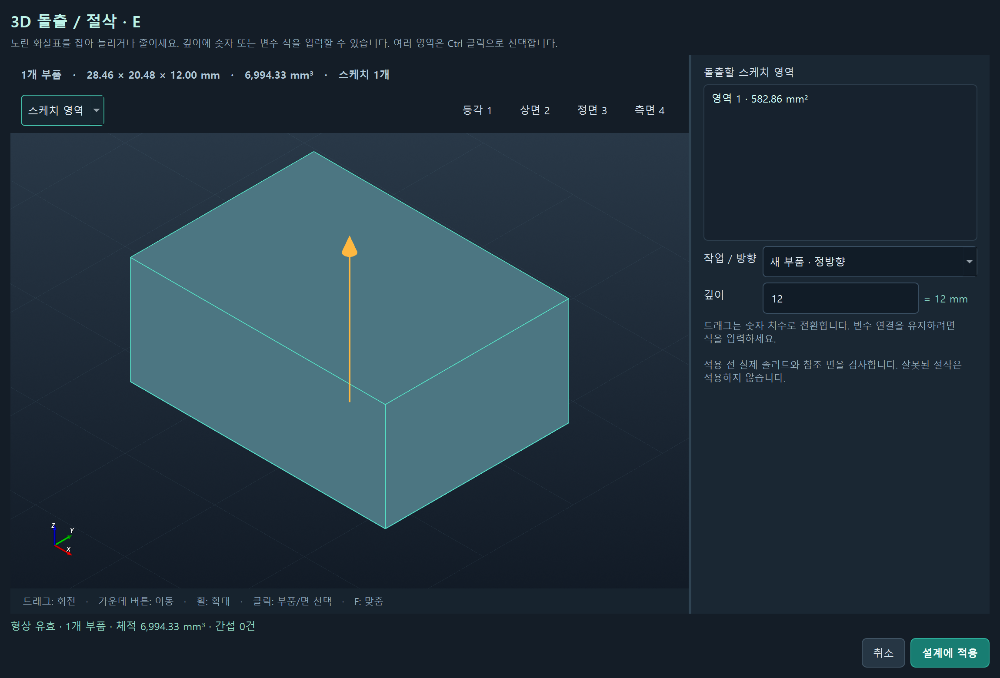
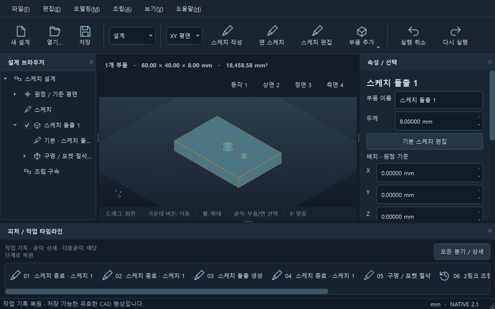
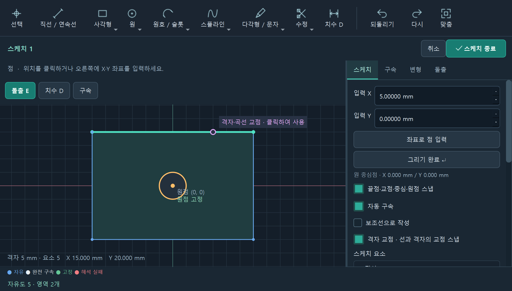
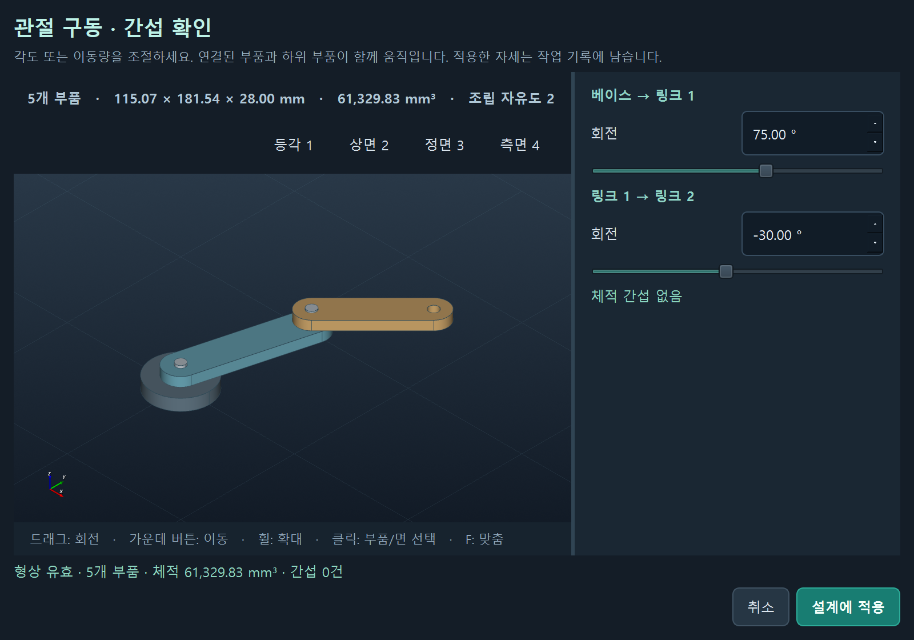
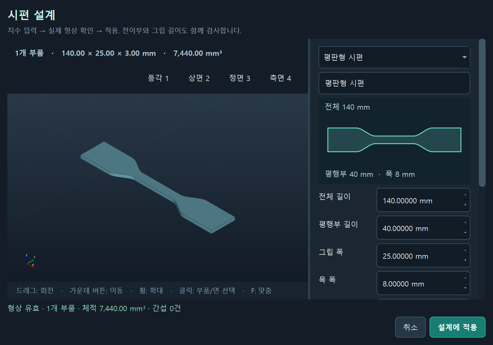

# Prompt CAD Studio · Native 2.6.1

사람이 직접 설계하고, 필요할 때 프롬프트로 도움을 받는 한국어 Windows CAD 앱입니다. **Qt Widgets + VTK OpenGL + Open CASCADE**로 실행하며 HTML, WebView, 브라우저, 내장 HTTP 서버를 사용하지 않습니다.

Fusion의 스케치 → 피처 → 조립 → 작업 기록 흐름을 참고했습니다. Autodesk 제품이 아니며 Fusion의 전체 기능을 구현한 것은 아닙니다.

## 2.6.1 · OpenAI 연결 안내

AI 패널의 **OpenAI 연결 · API 키 발급…**에서 공식 로그인·키 발급 페이지와 API 결제 설정을 열고, 발급한 키를 바로 입력할 수 있습니다. **도움말**과 **Ctrl+K** 도구 검색에서도 찾을 수 있습니다. 브라우저 로그인 후 키를 직접 붙여넣는 방식이며, 키는 이번 실행 동안만 사용합니다. 키 적용은 유료 요청을 실행하지 않으며 모델 선택 후 **설계 초안 생성**에서 인증을 확인합니다.

## 2.6.0 · 조립 이동 / 작업 평면 / 기존 설계 AI 편집

- 여러 부품이나 그룹을 선택하고 **M**으로 이동·회전합니다. 연결된 조립·폐루프·몸체 연산의 부품을 함께 옮기고, 회전 중심을 지정하며 관절 관계를 유지합니다. 고정 부품 이동은 명시적으로 선택하고 변수로 제어되는 위치는 보호합니다.
- **모델 → 작업 평면 · 오프셋 / 기울기**에서 XY/XZ/YZ를 기준으로 거리·각도를 정해 스케치합니다. 원본 스케치의 작업 평면을 다시 편집하면 연결된 기본 돌출도 함께 이동합니다. 외부 조립 연결·변수 위치·회전/스윕/로프트 단면 참조가 있는 경우 변경을 제한합니다.
- AI가 **기존 피처와 관절**을 직접 수정할 수 있습니다. 구멍 지름 축소·돌출 깊이·필렛 등의 치수와 관절의 독립 운동 축을 편집하고, 기존 ID·구속·다른 부품을 유지합니다. 현재 선택한 대상은 AI 패널 하단에서 확인합니다. 새 부품을 만들지 않는 편집 계획의 대상은 실제 부품 ID로 제한해 피처 ID 혼동을 줄였습니다.
- **OpenAI API → Astra 모델 선택**과 추론 강도 선택을 추가했습니다. 공식 모델명 `gpt-6-astra`와 Responses API를 사용하며 Ollama와 같은 CAD 도구·형상 검증을 적용합니다. 유료 요청은 실행하지 않았으며 실제 Astra 설계 품질 비교는 아직 하지 않았습니다.
- AI 입력창을 작은 창에서도 바로 보이게 하고 **모델 · 대기 설정**을 접을 수 있게 했습니다. OpenAI도 무제한 대기·진행 표시·취소를 지원합니다. 이름이나 치수 하나를 바꿀 때 건드리지 않은 위치·각도가 반올림되는 문제와 관절 입력 범위 문제를 수정했습니다.

[사용 방법](docs/USER_MANUAL_KO.md) · [AI 기대 수준과 실측 범위](docs/AI_EXPECTATIONS_KO.md) · [검증 기록](VALIDATION.md)

## 2.5.0 · 다중 선택 / 그룹 / 조립 연결 표시

- 3D 화면의 **Shift+클릭**으로 여러 부품을 추가·해제하고 **Shift+드래그**로 범위에 추가합니다. **범위 B** 버튼은 드래그로 선택하는 모드입니다. 왼쪽→오른쪽은 완전히 들어온 부품, 오른쪽→왼쪽은 닿은 부품을 선택합니다. 숨긴 부품은 제외하고 가려진 부품은 포함합니다.
- 뷰포트 위 **그룹 / 해제**, **Ctrl+G / Ctrl+Shift+G**, 브라우저 우클릭으로 그룹을 관리합니다. 그룹은 트리에 폴더로 표시되며 이름 변경·전체 선택·색상 일괄 변경이 가능합니다. 그룹은 선택용 묶음이고 강체 구속은 별도로 설정합니다.
- **관절 J** 버튼으로 강체·회전·슬라이더 등의 관절과 폐루프 연결 위치·축을 표시합니다. 표식 또는 오른쪽 연결 목록을 클릭하면 연결된 부품을 강조합니다. 부품에 가려진 표식도 보이며 접촉·간섭 분석을 뜻하지 않습니다.
- **Ctrl+C / V / X**, **Ctrl+Z / Y / Shift+Z**, **Ctrl+A**, **Delete**를 부품 다중 선택에 적용합니다. 내부 관절·그룹을 보존한 독립 복사본을 만들고 외부 관절은 제외합니다. 변수는 복사 시 계산된 치수로 고정합니다. 입력칸에서는 일반 텍스트 편집으로 동작합니다.
- 스케치에도 선택 요소 복사·붙여넣기·잘라내기와 빠른 그룹 해제를 추가했습니다. 고정·외부 참조 구속을 제외하고 내부 구속은 유지합니다. 작은 창에서는 작업 기록 패널을 접어 모델 공간을 확보합니다.

[다중 선택·그룹·단축키 사용법](docs/USER_MANUAL_KO.md) · [로컬 AI의 현실적인 기대 성능](docs/AI_EXPECTATIONS_KO.md). 피로해석 외부 모듈 연동은 이번 버전에 포함하지 않았습니다.

## 2.4.2 · AI 조립 구속 유지

회전 조인트를 만든 뒤 모델이 동일한 위치를 다시 지정해 초안 전체가 거부되는 문제를 수정했습니다. 이미 충족된 위치는 구속과 작업 기록을 보존하며 받아들이고, 실제로 구속된 부품을 이동하는 명령은 계속 거부합니다.

조립 요청의 관절 종류와 기준 부품·움직이는 부품 관계를 먼저 추출해 생성 규칙과 실제 CAD 검증에 사용합니다. 회전 관절이 고정 관절로 바뀌거나 부모·자식 관계가 뒤집히면 그대로 적용하지 않고 수정 요청을 보냅니다. 모델의 원문 해석까지 항상 정확하다는 뜻은 아니므로 초안과 조립 트리를 확인하세요.

새 부품 ID도 계획 전체에서 통일해 생성·피처·조립 단계가 같은 부품을 참조하게 합니다. 기존 보어를 다시 뚫으려는 오류 안내는 중복 명령 제거를 우선하며, 요청하지 않은 구멍 패턴을 추가하도록 유도하지 않습니다.

## 2.4.1 · CAD 작업 계획 AI / 빈 시작 화면

- AI 최대 대기에 **무제한 (취소 가능)**을 추가했습니다. 로컬 Ollama의 전체 대기와 응답 읽기 시간 제한을 해제하며, 생성 취소·앱 종료는 유지합니다. 기본 선택은 기존 10분입니다.
- Ollama는 설계 파일 전체를 새로 쓰는 대신 **CAD 작업 계획**을 만듭니다. 부품 생성·치수 편집·돌출·절삭·구멍·셸·필렛·나사·패턴·조립 등의 도구를 조합합니다. 특정 물건 이름 전용 경로가 아닌 같은 실행기를 사용합니다. 단품은 기본 형상 하나와 그 형상의 피처로 계획하며, 조립은 여러 부품과 구속으로 계획합니다.
- 각 작업은 기존 CAD 커널로 실행하고 실제 형상을 검증합니다. 잘못된 단계와 치수 관계를 모델에 전달하며 최대 두 번 수정합니다. 실패한 중간 결과는 현재 설계에 적용하지 않습니다. 요청에 필요한 도구·형상을 먼저 선택한 후 작업 계획을 만듭니다. Qwen3는 두 단계 모두 비추론 모드를 사용합니다.
- 작업 목록을 적용 전에 표시하고 작업 기록에 보존합니다. 변경 대상으로 지정하지 않은 부품·스케치·가져온 데이터는 유지합니다.
- 설명 문장을 반복하느라 CAD 명령 생성이 지연되지 않도록 작업 설명·요약 길이를 제한합니다. 실제 모델링 작업 수는 최대 32개로 유지합니다.
- 초안 맨 위에 실제 형상에서 계산한 크기·체적·부품 색상을 표시하고 모델의 설명과 구분합니다. 등각 화면 조명을 개선해 포켓·셸의 바닥과 내벽이 한 평면처럼 보이는 문제도 수정했습니다.
- AI의 생성·취소·적용 버튼은 패널 하단에 고정해 작은 창에서도 스크롤에 가려지지 않게 했습니다. 초안이 준비되면 실제 계산 결과가 보이도록 이동합니다.
- 앱은 **빈 설계**로 시작합니다. 이전 자동저장은 삭제하지 않으며 **파일 → 최근 자동저장 복구…**로 불러옵니다. 명시적으로 파일을 열면 해당 프로젝트가 표시됩니다.

임의의 요청을 가능한 도구로 설계하는 흐름이며 모든 물건의 완성도나 제조 적합성을 보장하지 않습니다. 누락한 치수는 모델이 정하므로 적용 전에 확인하세요. 한 계획은 최대 32개 작업이며 무제한 대기도 형상 검증이나 출력 길이 제한을 해제하지 않습니다.

## 2.4.0 · 파라메트릭 모델링 / 조립 / 도면 확장

- 저장 스케치에서 새로 만든 돌출과 절삭을 원본에 연결합니다. 스케치 변경이 여러 피처에 반영되고 깊이는 각 피처가 따로 유지합니다. 기존 프로젝트의 복사 스케치는 자동으로 연결하지 않습니다.
- 회전, 셸, 구배, 몸체 합치기/빼기/교집합, 평면 분할, 몸체 대칭·직선/원형 패턴과 피처 순서·삽입·억제를 추가했습니다.
- 대칭·양방향·테이퍼·닫힌 단면의 얇은 벽 돌출, 동적 관통과 같은 부품의 평행한 면까지 절삭을 지원합니다. 구멍은 원통 자리파기·접시머리 형태도 만들 수 있습니다.
- STEP/IGES/STL/BREP를 가져와 원본 형상을 프로젝트에 보관합니다. 연결 복제, 볼/평면/핀 슬롯 관절, 관절 한계와 비율 모션 연결을 추가했습니다.
- 각도·최소 간격·단면적 검사, 부품별 재질·질량·관성과 변수 구성표를 제공합니다. 지정한 밀도는 기존 2R 동역학에도 반영됩니다.
- 단면도·확대 상세도·다중 시트 PDF·부품표 CSV, 단일 절곡 판금과 전개 DXF를 추가했습니다.
- AI에는 새 도구의 구조를 안내하고, 가져온 형상의 바이너리는 모델에 보내지 않고 로컬에서 보존합니다.

도구는 **Ctrl+K**로 이름을 검색할 수 있습니다. [새 기능 사용법](docs/USER_MANUAL_KO.md#24-확장-도구) · [전체 요청의 구현 상태와 남은 범위](docs/DEVELOPMENT_SCOPE.md).

Fusion 전체 기능과 같은 수준을 뜻하지 않습니다. 투영 연동·완전한 위상 추적, 하위 조립 관리, 접촉 동역학, GD&T, 다중 절곡, CAM, PCB, 범용 해석과 동시 협업은 남아 있습니다.

## 2.3.1 · 나사산 / 스케치 추천·편집

**스케치:** 면의 참조 경계·교점 위 점 추천, 원호 중점, 선 그리기의 접선·법선·평행·수직 추천과 지속 구속을 보강했습니다. **구속 ▾** 메뉴에 자주 쓰는 조건을 모았고 **Shift+E**로 선택한 스케치/피처를 다시 편집합니다. 자유 배치 G가 켜져 있으면 추천은 꺼집니다.

원통 면 클릭 → **이 면에 수나사 / 암나사 만들기**, 또는 부품 선택 후 **T**. **3D 도구 → 나사산**과 **Ctrl+K** 검색에서도 찾을 수 있습니다.

- 축과 구멍의 원통 면을 자동 구분하고 미터 나사 치수를 추천합니다. M2~M48 치수 프리셋과 사용자 피치·길이, 시작 간격, 반대쪽 시작, 우나사·좌나사를 지원합니다.
- 반경 여유를 지정해 수나사를 줄이거나 암나사를 넓힐 수 있습니다. 숫자 입력에 변수 식도 사용할 수 있습니다.
- 60° 절단 프로파일을 실제 솔리드로 절삭하므로 STEP·STL에도 나사 형상이 남습니다. 생성·수정·삭제·실행 취소와 선택 면 참조를 기록합니다.
- 현재 단일 시작 나사, 피처당 1~32 회전입니다. ISO 공차 등급 인증·관용 테이퍼 나사·둥근 뿌리 프로파일은 지원하지 않습니다.

[나사산 사용 방법](docs/USER_MANUAL_KO.md#나사산--수나사--암나사)

## 2.3.0 · 직접 돌출 / 자유 배치 / 치수 변수

- **3D 돌출 E:** 저장한 스케치의 닫힌 영역을 3D에서 클릭하고 E를 누르세요. 노란 화살표 드래그와 깊이 입력을 지원하며, 기존 돌출 피처도 3D에서 깊이를 바꿀 수 있습니다.
- **선택 대상:** 뷰포트 위에서 자동·점·선/모서리·면·체적/부품·스케치 영역을 고릅니다. Shift+1~6도 지원합니다.
- **자유 배치 G:** 스케치의 점·선·닫힌 영역을 격자나 기존 요소에 붙이지 않고 그립니다. Alt를 누르는 동안에도 스냅/자동 구속을 사용하지 않습니다. 이후 치수와 구속을 넣으세요.
- **과다 구속:** 중복 조건은 구속 탭의 빨간 경고로, 모순된 조건은 만족하지 못한 구속 ID와 함께 오류로 표시합니다. 해결 전에는 적용하지 않습니다.
- **변수 U:** `두께=5`, `폭=두께*4`를 정의하고 일반 부품 속성·스케치 치수 구속·돌출 깊이에 연결할 수 있습니다. 변수 변경, 형상 재계산, 저장과 실행 취소를 지원합니다.
- **AI 기본 표시:** Ollama 모델을 자동으로 찾습니다. 현재 설계의 표시용 좌표 캐시를 요청에서 제외하고, 최대 대기 시간을 3/5/10/20분 또는 무제한 중 선택합니다. 기본값은 10분이며 생성 중 취소와 창 닫기를 지원합니다. 실행 중인 CAD 커널 연산 자체의 강제 중단은 지원하지 않습니다.

**[사용 설명서 / 단축키 전체 목록](docs/USER_MANUAL_KO.md)** · 앱에서 **F1** · [검증 기록](VALIDATION.md)



## 2.2.1 · AI 멈춤 수정 / 스케치 그룹

- **Ollama 진행 상태:** 모델 준비, 생성된 응답 길이, 경과 시간과 형상 검증 상태를 표시합니다. 생성 중에도 CAD 작업과 저장을 계속할 수 있습니다. **생성 취소** 또는 하단 **AI 시간 · 취소**를 누르면 연결을 끊습니다. 창 닫기도 AI 답변을 기다리지 않습니다. 네트워크 정지·시간 초과·불완전 응답은 오류로 표시하며, 취소한 작업의 늦은 결과는 적용되지 않습니다.
- **색상:** 부품 클릭 → 오른쪽 속성 맨 위 **● 부품 색상 변경**. 상단 **부품 색상…** 버튼과 모델링 메뉴에서도 찾을 수 있습니다.
- **그룹화:** 스케치에서 요소를 여러 개 선택하거나 닫힌 영역을 선택하고 **그룹 Ctrl+G**를 누릅니다. 돌출 탭에서 저장한 그룹을 선택해 **그룹 돌출 / 그룹 절삭**을 사용합니다. 그룹 요소 선택으로 이동·복사 등 기존 편집 도구도 사용할 수 있습니다.
- **영역 추천:** 스케치 안쪽이나 단일 영역의 경계 위에 커서를 올리면 영역을 강조합니다. **E**로 돌출 설정을 열고 **Ctrl 클릭**으로 여러 영역을 고릅니다. 여러 영역이 맞닿은 경계에서는 사용할 안쪽 영역을 클릭하세요.
- **블록 재사용:** 돌출 후에도 원본 스케치를 보존합니다. 다른 부품의 평면을 클릭 → **저장 스케치 / 그룹 재사용** → 스케치 선택 → 그룹과 위치·깊이를 지정합니다. 같은 원형 그룹으로 돌기 또는 구멍을 만들 수 있습니다. 2.2.1 당시에는 복사 방식이며, 2.4.0에서 저장 스케치로 새로 만든 피처는 원본에 연결됩니다.

[스케치 그룹 화면](docs/native-profile-groups.png) · [검증 결과](VALIDATION.md)

## Windows 다운로드

[Windows 네이티브 앱 다운로드](https://github.com/donghyeok8649daniel/AI_CAD_Stuff/releases/latest)

2.2.0은 선 선택→돌출, 구속 상태 색상, 격자 교점 스냅, 길이 측정, 면 기반 구멍, 스윕·로프트·곡면·3D 필렛, 정투상 도면, 폐루프와 두 종류의 해석을 추가합니다. 축·구멍 공차, 겹친 체적을 표시하는 간섭 검사, 설치된 Ollama 모델 자동 검색도 포함합니다. 실제 지원 조건은 [설계·해석 안내](docs/ENGINEERING.md)에 명시돼 있습니다. 업데이터의 `tkinter` 배포 오류도 수정돼 있으며 Python을 따로 설치할 필요가 없습니다.

**기존 설치 업데이트:** 앱의 **도움말 → 업데이트 확인**을 사용하세요. 작업 저장 후 앱을 종료하고 같은 폴더를 갱신한 뒤 다시 실행합니다. 2.1.0 이전 버전은 릴리스의 작은 `PromptCADStudioUpdater.exe`만 받아 실행하세요. 바탕화면 바로가기의 설치 위치를 찾으며, 필요하면 `PromptCADStudio.exe`와 `_internal`이 있는 기존 폴더를 선택할 수 있습니다. 새 버전마다 ZIP을 다시 풀어 별도 설치 폴더를 만들 필요가 없습니다.

업데이트는 GitHub 배포 SHA256과 파일별 해시를 검증하고 변경된 파일만 교체합니다. 성공하면 임시 ZIP·교체용 백업과 목록에서 빠진 원본 프로그램 파일을 지웁니다. 사용자 프로젝트와 자동 복구 데이터는 보존합니다. 편집한 예제·문서는 덮어쓰지 않습니다. 중단된 교체는 다음 실행에서 복구하며, 임시 다운로드와 교체 파일을 위한 여유 공간은 필요합니다. 예전에 사용자가 따로 풀어 둔 다른 설치 폴더는 자동 삭제하지 않습니다.

**처음 설치할 때:**

1. ZIP 전체를 풀고 `PromptCADStudio.exe`를 실행합니다. `_internal` 폴더도 함께 있어야 합니다.
2. Python, Node, WebView2를 따로 설치할 필요가 없습니다. Windows 10/11 64비트와 OpenGL을 지원하는 그래픽 드라이버가 필요합니다.
3. `Create Desktop Shortcut.ps1`을 실행하면 바탕화면 바로가기를 만듭니다. 실행 정책을 변경할 필요 없이 EXE를 우클릭해 직접 바로가기를 만들어도 됩니다.

기본 모델링·구속·저장·내보내기는 오프라인으로 작동합니다. 자동 복구 파일은 `%LOCALAPPDATA%/PromptCADStudio/native-autosave.cad.json`입니다. 미완료 스케치는 **스케치 종료** 전까지 자동 복구에 포함되지 않습니다.



## 작업 공간

상단의 **설계 / 조립 / 시편**을 선택하면 해당 도구가 나타납니다. 어두운 작업 공간, 청록색 강조, 단위가 포함된 입력칸과 상단 고정 종료 버튼을 사용합니다. 창이 좁을 때 패널은 스크롤되고 도구 모음의 추가 도구는 펼침 메뉴로 접근합니다.

## 처음 설계하기

1. 상단에서 **XY / XZ / YZ 평면 → 스케치 작성**을 선택합니다.
2. 사각형·원 등을 클릭하거나 오른쪽 X/Y 좌표 입력으로 정확히 작성합니다.
3. 상단 **스케치 종료**로 열린 선도 저장합니다. 입체를 만들려면 **돌출 탭 → 영역 / 깊이 → 돌출 적용**을 누릅니다. 저장한 스케치는 설계 브라우저에서 다시 편집할 수 있습니다.
4. 3D 모델의 평평한 면을 클릭하고 **선택 면에서 스케치**를 누릅니다.
5. 원을 그린 후 **안쪽으로 파내기**와 깊이를 지정하면 구멍·포켓이 생깁니다.

모든 길이는 mm, 회전은 도 단위입니다. 3D 화면에서는 드래그 회전, 가운데 버튼 이동, 휠 확대를 사용합니다. 스케치에서는 가운데 / 오른쪽 드래그로 이동합니다. F는 맞춤, L 직선, C 원, R 사각형, D 선택 요소 치수, Enter 그리기 완료, Ctrl+Enter 스케치 종료, Ctrl+A 전체 선택, Esc 선택 도구입니다.

## 스케치와 구속



- 그리기: 연속선, 2점·중심·3점 사각형, 중심·지름·3점 원, 중심·3점 원호, 타원, 정다각형 2종, 슬롯 2종, 맞춤점·제어점 스플라인, 점, 텍스트, 보조선.
- 편집: 자르기(선·원·호), 연장(선), 분할(선·호), 간격띄우기(연결 직선·원·호), 두 직선의 필렛·모따기, 이동·복사·회전·배율·대칭, 직사각형·원형 패턴.
- 스냅: 원점, 교점, 끝점, 중간점, 중심, 사분점, 선·곡선 위의 최근접점. 커서를 가까이 대면 선이 굵어지고 추천 위치가 표시됩니다. 선·원·호 교점은 즉시 계산하며 다른 곡선은 CAD 커널 해석 후 표시합니다.
- 자동 구속: 원점, 연결점, 수평·수직, 중간점, 교점, 점-곡선의 관계를 저장합니다. 단순히 커서 위치만 맞추는 기능이 아닙니다.
- 구속 21종: 고정, 수평·수직, 일치, 거리·X/Y 거리·각도·반지름·직경, 평행·직각·동일·동심·동일 직선·접선·법선·중간점·대칭·점-곡선·곡률 연속.
- **점 A를 원점에 고정**하고 원의 직경을 지정하면 완전 구속됩니다. 자유도와 모순된 구속 오류를 표시합니다. 치수 구속은 캔버스의 치수 또는 목록에서 더블클릭해 수정합니다. 끝점을 클릭하면 그 점이 구속 A에 연결되고 Ctrl 클릭으로 두 번째 점을 선택합니다. 같은 선의 양 끝점도 선택할 수 있습니다.
- 면 경계의 직선·원·호를 보조선으로 투영해 고정할 수 있습니다. 투영은 생성 당시 형상의 복사이며 원본 면 변화에 자동 연결되는 투영은 아닙니다.

구속 A/B 요소, 각 요소의 점, 대칭 기준선 C를 지정합니다. 선 하나의 수평·수직·각도는 B를 비웁니다. 고정의 점 A를 ‘전체’로 지정하면 요소의 모든 매개변수를 고정합니다. 일부 접선·점-곡선 구속은 유한 호의 연장 곡선 기준입니다.

닫힌 영역의 기본 선택은 가장 큰 영역 하나이며 안쪽 윤곽은 구멍입니다. 영역 선택에서 전체 영역을 고르면 분리된 솔리드도 만들 수 있습니다. 위상을 바꾸는 수정 및 선택 도형 변형은 해당 요소의 구속을 해제하며 실행 취소로 복구할 수 있습니다.

## 부품과 조립

기본 형상: 원통형·평판형 시편, 웨이퍼, 링크, 구멍판, L 브래킷, 원통·튜브, 스케치 돌출, 5부품 2링크 조립 예제. 이름·치수·색상·위치·회전을 수정하고 복제할 수 있습니다.

조립 구속은 **강체 / 회전 / 슬라이더 / 원통 / 볼 / 평면 / 핀 슬롯**입니다. 부모·자식 부품과 기준점, 오프셋, 관절 값을 지정합니다. 고정된 기준 부품에서 자식으로 배치가 전파됩니다. 트리에서 구속을 더블클릭하면 편집합니다. **관절 운동 한계 / 모션 연결**에서 이동 범위와 비율을 지정합니다. 트리 형태의 조인트에 **폐루프 연결**을 추가하고 수동 관절을 지정하면 닫힘 조건을 풉니다. **4절 링크 추가**로 실제 연결된 예제를 시작할 수 있습니다.

### 색상 · 축과 구멍 공차 · 간섭

부품 선택 후 **모델링 → 부품 색상** 또는 속성의 색상 버튼으로 바꿉니다. **모델링 → 축 만들기**에서 외경·길이·내경을 지정합니다. **조립 → 축 / 구멍 공차**에서 실제 축·구멍 치수를 선택하고 상한/하한 편차(mm)를 입력합니다. 허용 지름과 지름 기준 최소/최대 틈새, 틈새·억지·중간 끼워맞춤을 계산합니다. 조건은 작업 기록에 남고, 치수 변경 후 다시 계산하면 현재 치수를 사용합니다. CSV 공차표와 정투상 도면의 치수 한계표에도 표시합니다.

**조립 → 간섭 검사**는 겹친 부품 쌍과 실제 교차 체적(mm³)을 표시하고 선택한 겹침 영역을 빨갛게 보여 줍니다. 자동 형상 제거, 접촉 반력 해석은 수행하지 않습니다.

### 면 조인트와 관절 구동

1. **조립 → 면으로 조인트**를 누르고 기준 부품의 평면, 움직일 부품의 평면을 순서대로 클릭합니다.
2. 회전·강체·슬라이더·원통 중 연결을 선택하고 면 간격과 축 주위 각도를 지정합니다. 실제 형상을 확인한 뒤 적용합니다.
3. **관절 구동**의 슬라이더나 수치로 각도·이동량을 바꿉니다. 하위 부품도 연결을 따라 움직이고 체적 간섭이 생긴 부품은 붉게 표시됩니다.
4. 적용한 자세, 선택 면과 좌표계는 프로젝트·작업 기록에 남습니다. 부모 치수 변경 시 선택 면의 위치를 다시 계산합니다. 기준 피처/면 구성이 바뀌면 기존 형상을 유지하고 면 재선택을 요청합니다.

면 조인트의 축은 평면 중심과 법선입니다. 링크 구멍 중심 등에는 **기준점으로 연결**에서 `hole_1_bottom`, `hole_2_top` 등 형상 기준점을 사용합니다. 조인트로 연결된 자식의 배치는 관절/오프셋으로 편집하며 일반 위치 입력칸은 잠깁니다.

**로봇 치수**는 기존 2링크 조립의 링크 중심 간격·폭·두께·핀 직경·지름 여유·층 간격·관절 각도를 함께 편집합니다. 새 조립을 추가할 때 기존 부품을 보존합니다. 구동은 기구학적 자세 미리보기이며 동역학·모터 제어·자동 충돌 회피는 포함하지 않습니다.



### 시편 전용 편집

**시편 → 시편 설계**에서 원통형·평판형 시편 또는 웨이퍼를 선택합니다. 선택한 기존 시편이 있으면 그 치수와 이름을 편집합니다. 개략 치수도와 실제 3D 형상을 함께 표시하고, 평행부 단면적·한쪽 그립 길이 또는 웨이퍼 두께의 µm 환산을 계산합니다. 치수가 유효하지 않으면 적용을 막고 이유를 표시합니다. 다른 부품이 있어도 미리보기는 해당 시편에 집중하며 적용 시 기존 설계는 보존합니다.

치수는 사용자 정의 값입니다. 전이부는 양 끝 접선이 수평인 베지어 곡선이며 특정 시험 규격에 적합하다는 판정을 하지 않습니다.



## 작업 기록

하단 타임라인은 성공한 설계 변경마다 저장합니다. 항목 클릭으로 상세를 보고 더블클릭으로 그 단계의 형상을 복원합니다. 복원 후 새로 수정해도 이전 분기를 보존합니다.

기록에는 다음 정보가 들어갑니다.

- 변경 전후의 실제 설계 필드와 치수.
- 스케치에서 사용한 도구 순서와 각 도구 전후의 요소·구속.
- 스케치한 부품, 면 번호, 면 좌표계, 법선, 참조한 이전 피처.
- 돌출·절삭 깊이, 연결한 구속과 요소 ID.
- 조립 연결과 관절 값, AI 공급자·프롬프트·설명.

스케치 내부 작업은 **스케치 완료 시** 피처 기록에 함께 저장합니다. 마우스 이동·확대 같은 뷰 조작과 취소한 스케치는 설계 기록에 포함하지 않습니다. 기록을 30단계로 잘라내지 않으며 프로젝트 파일 한도는 32 MB입니다. 예전 파일에 없었던 과거 작업은 소급 생성하지 않습니다.

## 설계 AI · GPT 없이 사용하기

상단 **설계 명령**을 엽니다. 초안을 생성하면 실제 CAD 형상을 검사하고, **검증된 초안 적용**을 눌렀을 때 프로젝트에 반영합니다. 생성된 파이썬이나 외부 코드를 실행하지 않습니다.

| 방식 | 필요한 것 | 역할 |
|---|---|---|
| 오프라인 치수 명령 | 없음 | 형상 이름과 치수를 규칙으로 해석. AI 모델은 아님 |
| 로컬 AI · Ollama | 이 PC에 설치된 Ollama와 모델 · 자동 검색 | 자유 문장 → 선언형 설계. API 키 불필요 |
| OpenAI | API 키와 사용 가능한 모델 | 자유 문장 → 선언형 설계. API 사용료 별도 |

로컬 명령 예: `구멍판 길이 80, 폭 60, 두께 6, 구멍 수 4` / `목 직경 6 mm` / `2링크 로봇 조립`.

설계 명령에서 **로컬 AI · Ollama**를 고르면 설치된 모델을 자동 검색합니다. 모델이 여러 개면 목록에서 선택하고, 추가 설치 후 **새로 찾기**를 누르세요. 기존 Ollama가 꺼져 있으면 시작하며 검색만으로 모델을 다운로드하지 않습니다. 추론은 `http://127.0.0.1:11434/api/chat`에 연결합니다. **로컬 AI 설치 / 모델 다운로드** 버튼 또는 패키지의 `Local AI Setup.ps1`로 Ollama와 선택한 모델 1개를 설치할 수 있습니다. 이미 받은 프로그램·모델은 공용으로 재사용합니다. 모델 파일은 수 GB이므로 CAD ZIP에는 중복 포함하지 않습니다. 인터넷 다운로드 후에는 로컬 모델을 사용하며 API 키가 필요하지 않습니다. [Ollama 공식 구조화 출력 문서](https://docs.ollama.com/capabilities/structured-outputs).

OpenAI 키는 비밀번호 입력란 또는 `OPENAI_API_KEY` 환경변수로 받습니다. 입력한 키는 이번 실행의 메모리에만 두고 프로젝트·자동 저장 파일에 기록하지 않습니다. 현재 설계와 프롬프트가 OpenAI API로 전송됩니다. [OpenAI 공식 구조화 출력 문서](https://developers.openai.com/api/docs/guides/structured-outputs).

이전 버전에서 Qwen3 8B(Q4_K_M)의 작은 원통 생성·수정을 검증한 기록은 [검증 기록](VALIDATION.md)에 있습니다. 속도와 성공 여부는 PC, 모델, 요청과 실행 중인 다른 프로그램에 따라 달라집니다. OpenAI 유료 요청은 실행하지 않았습니다. 별도 학습한 전용 설계 모델이 포함된 제품은 아닙니다.

## 저장과 내보내기

- `.cad.json`: 편집 가능한 형상 매개변수, 스케치, 구속, 조립, 전체 분기 기록. 1.x / 2.0 프로젝트도 읽습니다. 독립 스케치와 면 조인트를 저장한 새 프로젝트는 2.1 이상에서 여세요.
- `.step`: 정확한 솔리드 CAD 교환. 색상과 부품 구분 포함.
- `.stl`: 삼각형 메시.
- **Fusion / Inventor 변환 ZIP**: 전체·부품별 STEP, 프로젝트, Autodesk 앱에서 실행할 변환 도구. 해당 앱에서 실제 `.f3d` / `.ipt`로 변환합니다. 확장자만 바꾼 파일을 만들지 않습니다.

**파일 → 내보내기**에서 STEP·STL·F3D·IPT를 각각 선택합니다. F3D는 출력 경로가 지정된 Fusion 변환 스크립트를 준비하고, IPT는 Inventor가 감지되면 선택 부품을 변환합니다. 없으면 변환 준비 폴더를 제공합니다. F3D/IPT는 앱 자체의 직접 저장 형식이 아닙니다. Autodesk에서의 실제 변환은 아직 시험하지 않았고 Autodesk 스케치·피처 타임라인 재구성은 지원하지 않습니다.

## 지원 범위

최대 64개 독립 스케치, 256부품, 부품당 피처 128개, 스케치당 128요소·160구속·600수치변수입니다. 기준 면의 위상이 달라져 참조가 어긋나면 오류를 내고 기존 형상을 유지합니다. 영구적인 면·모서리 추적 체계는 아닙니다.

스윕·로프트·쉘 곡면·3D 필렛/모따기, 점 폐루프, 2R 로봇 동역학, 기본 시편 선형 탄성 해석, 정투상 도면 SVG/DXF/PDF를 지원합니다. 기어 전용 도구, 일반 다물체 접촉 동역학, 소성·파단·피로, 도면 기하공차, 시험 규격 인증은 지원하지 않습니다. 표점 길이 규칙 검사는 전체 규격 인증과 다릅니다.

## 소스 실행과 빌드

Windows / Python 3.12 권장.

```powershell
python -m venv .venv
.venv\Scripts\python.exe -m pip install -r requirements-native.txt
.venv\Scripts\python.exe native_desktop.py
.venv\Scripts\python.exe -m PyInstaller NativeCAD.spec
.venv\Scripts\python.exe -m PyInstaller Updater.spec
.venv\Scripts\python.exe scripts\package_windows.py dist\PromptCADStudio PromptCADStudio-Windows-x64-v2.6.1.zip --updater dist\PromptCADStudioUpdater.exe
```

`desktop.py`, `Start CAD.vbs`, `setup.ps1`도 네이티브 앱을 실행·설치합니다. 이전 웹 클라이언트는 별도 개발용 `launch.py`와 `requirements.txt`로 남겨 두었으며 Windows 앱에는 포함하지 않습니다.

```powershell
python -m pip install -r requirements-dev.txt -r requirements-native.txt
python -m pytest -q
python native_desktop.py --no-restore --smoke-test native-smoke.json
```

[검증 기록](VALIDATION.md) · [외부 라이브러리와 라이선스](THIRD_PARTY.md)
