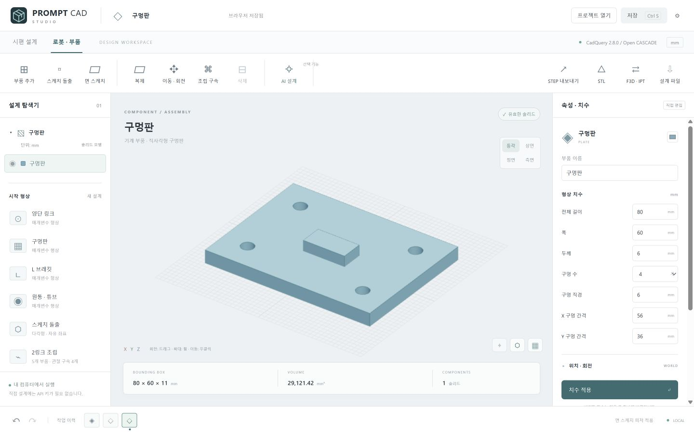

# AI_CAD_Stuff · Prompt CAD Studio

한국어 로컬 CAD 앱입니다. **사람이 직접 설계하는 것이 기본**이며, OpenAI API 키를 연결하면 프롬프트로 설계 초안을 만들고 수정할 수 있습니다. 단위는 mm입니다.

Fusion의 작업 공간·부품 트리·중앙 3D 뷰·속성 편집·타임라인 흐름을 참고한 독립 구현입니다. Autodesk 제품이나 Fusion 플러그인이 아닙니다.

## Windows 앱 다운로드

[최신 Windows 앱 ZIP 다운로드](https://github.com/donghyeok8649daniel/AI_CAD_Stuff/releases/latest)

1. ZIP 전체를 풀고 `PromptCADStudio.exe`를 실행하세요. `_internal` 폴더도 함께 있어야 합니다.
2. Python을 따로 설치할 필요 없이 독립 창에서 동작합니다. Windows 10/11 64비트와 Microsoft Edge WebView2 Runtime이 필요합니다.
3. 왼쪽에서 형상을 선택하고 치수를 편집하거나, **면 스케치 / 조립 구속**을 사용하세요.

직접 설계·미리보기·내보내기는 오프라인으로 작동합니다. AI만 별도 API 연결이 필요합니다. 데이터는 `%LOCALAPPDATA%/PromptCADStudio/`에 저장합니다. 창을 닫으면 내장 CAD 서버도 종료됩니다. 이 PC의 바탕화면 바로가기는 준비한 실행 파일을 엽니다.



소스 개발용 브라우저 실행은 `launch.py` 또는 `Start CAD.vbs`를 사용합니다. 기본 주소는 `http://127.0.0.1:18760`이며, 기존 서버를 재사용합니다. 브라우저를 닫아도 개발 서버는 유지되므로 **설정 → 로컬 서버 종료**로 종료하세요.

## 소스에서 개발 환경 설치

Windows 64비트 / Python 3.12를 권장합니다. 브라우저는 WebGL2를 지원해야 합니다. 첫 설치에는 인터넷 연결이 필요하며, 설치 후 직접 설계·미리보기·내보내기는 오프라인으로 동작합니다. Three.js도 로컬 파일로 포함했습니다.

```powershell
git clone https://github.com/donghyeok8649daniel/AI_CAD_Stuff.git
cd AI_CAD_Stuff
# 필요하면 Python 실행 파일 경로를 지정
.\setup.ps1 -PythonPath 'C:\path\to\python.exe'
.\create-shortcut.ps1
.\.venv\Scripts\python.exe launch.py
```

PowerShell 스크립트 실행이 제한된 환경에서는 해당 보안 정책을 변경하지 않고 아래 Python 명령을 직접 실행할 수 있습니다.

```powershell
python -m venv .venv
.\.venv\Scripts\python.exe -m pip install -r requirements.txt
.\.venv\Scripts\python.exe launch.py
```

Python 3.11–3.13 대상으로 설치하도록 구성했으며, 실제 검증 환경은 Windows / Python 3.12.14 / CadQuery 2.8.0 / Open CASCADE 7.9.3입니다. 다른 플랫폼·Python 버전은 별도 검증하지 않았습니다. `requirements-lock.txt`는 이 Windows 환경의 전체 의존성 기록입니다.

## 직접 설계

| 작업 공간 | 기본 형상 |
|---|---|
| 시편 설계 | 목이 얇은 원통형 시편, 평판형 시편, 플랫 깊이를 편집하는 웨이퍼 |
| 로봇 · 부품 | 양단 링크, 구멍판, L 브래킷, 원통·튜브, 다각형 스케치 돌출, 2링크 조립 예제 |

- **부품 추가 / 복제 / 삭제:** 프로젝트당 최대 12개 부품. 마지막 부품은 삭제하지 않습니다.
- **치수:** 길이·두께·목·전이부·구멍 간격 등을 수정합니다. 모순된 치수는 거부하며 기존 설계를 유지합니다.
- **스케치 돌출:** 2D 스케치·구속 편집 창에서 사각형·다각형·구멍을 그리거나 외곽점을 `X, Y`로 한 줄씩 입력합니다. 3–32개 점을 순서대로 연결합니다. 마지막 점을 반복하지 않습니다. 구멍은 `X, Y, 직경`으로 최대 16개 입력합니다.
- **위치와 회전:** 로컬 X → Y → Z 순서로 회전하고 월드 X/Y/Z 위치로 이동합니다.
- **선택:** 부품 트리 또는 3D 형상을 클릭합니다. 눈 아이콘은 미리보기만 숨기며 내보내기에서는 모든 부품이 포함됩니다.
- **화면:** 드래그 회전, 휠 확대, 우클릭 드래그 이동. 등각·상면·정면·측면 전환과 화면 맞추기를 제공합니다.
- **작업 이력:** 현재 세션의 최근 30개 설계 상태를 되돌리거나 다시 실행합니다. Fusion의 피처 의존성/스케치 구속 타임라인과는 범위가 다릅니다.
- **검증:** CAD 솔리드 유효성, 양의 부피, 형상별 치수 관계, 구멍 간격, 스케치 교차, 조립 부품의 체적 간섭을 검사합니다. 표시용 메시와 STEP/STL은 같은 CAD 솔리드에서 생성합니다.

### 좌표 기준

- 원통형·평판형 시편: X축 방향, 길이 중심은 원점. 평판 두께는 Z=0을 중심으로 배치합니다.
- 링크·구멍판: XY 중심, 바닥 Z=0. 링크 길이는 양 끝을 포함한 전체 길이입니다.
- 웨이퍼·원통·튜브: 원 중심 XY=(0,0), 바닥 Z=0. 웨이퍼 플랫은 +X 가장자리를 잘라 만듭니다.
- 브래킷: 바닥 X=0…길이, Y는 폭 중심, Z=0. 수직 판은 X=0…두께에 있습니다.
- 스케치 돌출: 사용자가 지정한 XY 외곽선, 바닥 Z=0.

## 면 스케치와 구속

**면 스케치:** 도구를 누르고 3D 모델의 평평한 면을 클릭합니다. 선택 면의 경계가 2D 캔버스에 표시됩니다. 사각형은 드래그, 다각형은 꼭짓점 클릭, 원형 구멍은 중심 클릭으로 그립니다. 깊이를 입력하고 돌출 또는 안쪽 파내기를 적용합니다. 하면·측면·회전한 부품도 면의 로컬 좌표로 계산합니다. 부품당 최대 8개 피처이며, 앞 피처를 제거하면 이후 의존 피처도 제거됩니다.

**스케치 구속:** 점 고정, 수평, 수직, 두 점 거리, X축 기준 각도를 추가하고 **구속 해석**을 누릅니다. 사각형을 그리면 수평·수직 구속이 자동 생성됩니다. 고정점과 두 변의 치수까지 지정하면 완전 구속할 수 있습니다. 외곽점의 자유도와 잔차를 표시하고 모순된 구속은 거부합니다. 구멍은 별도 좌표·직경으로 정의하므로 외곽점 자유도에 포함하지 않습니다.

**조립 구속:** 부품 고정으로 기준 부품을 고정하고, 부모·자식 부품의 원점·상하면·구멍 중심을 연결합니다. 강체, 회전, 슬라이더, 원통 구속을 지원합니다. 회전은 관절 각도, 슬라이더는 관절 이동, 원통은 둘 모두를 **관절 구동**으로 편집합니다. 연결된 자식 부품은 부모 형상·배치를 따라 다시 계산됩니다. 구속 편집의 6개 오프셋은 관절 기준 프레임과 현재 구동값을 정의합니다.

2링크 예제는 고정 베이스, 회전 관절 2개, 강체 연결 2개와 자유도 2로 구성됩니다. 한 자식에 하나의 부모를 갖는 트리 조립이며 순환·중복·고정 충돌을 차단합니다. 폐루프 조립, 접촉 운동, 조인트 한계, 동역학 해석은 지원하지 않습니다.

면 참조는 피처 생성 당시의 면 인덱스·면 수·법선으로 확인합니다. 앞 형상의 위상이 바뀌면 면을 다시 선택해야 할 수 있으며, 범용 CAD의 영구적인 위상 추적 기능은 아닙니다.

## 선택형 설계 AI

AI는 별도 `cadstudio/planner.py` 모듈로 분리되어 있습니다. 모델을 새로 학습시키는 대신, 설계 전용 지침·선언형 CAD 언어·기하 검증기를 연결한 설계 엔진입니다.

1. 사용자 요청과 현재 설계, 선택 부품 ID를 OpenAI Responses API에 전달합니다.
2. Structured Outputs로 허용된 형상의 JSON만 받습니다.
3. Pydantic으로 타입·범위·기하 관계를 검증합니다.
4. 실제 CAD 커널로 솔리드와 간섭을 검사합니다.
5. 실패하면 검증 오류를 전달해 한 번 더 교정합니다. 요청당 최대 2회 호출합니다.
6. 검증된 초안을 미리 보여주고, 사용자가 **초안 적용**을 눌러 기존 설계에 반영합니다.

모델이 작성한 Python·쉘·임의 코드·수식을 실행하지 않습니다. 부품 라이브러리를 확장하려면 개발자가 새 모델 스키마, 검증 규칙, CAD 생성 함수를 직접 추가해야 합니다.

### 키 설정

**ChatGPT Plus/Pro 구독은 API 사용 권한·요금과 별개입니다.** 이 앱에 로그인하거나 ChatGPT 대화를 연결하는 방식이 아닙니다. OpenAI API 계정의 API 키가 필요합니다.

키를 채팅, 브라우저, 코드 또는 프로젝트 JSON에 붙여넣지 마세요. 권장 방법은 Windows **계정의 환경 변수 편집**에서 사용자 환경변수를 설정하는 것입니다.

| 이름 | 값 |
|---|---|
| `OPENAI_API_KEY` | 사용자의 OpenAI API 키 |
| `OPENAI_MODEL` | 선택 사항. 기본 `gpt-4.1`. Responses + Structured Outputs를 지원하고 계정에 허용된 모델 |

서버를 종료하고 바로가기로 다시 실행한 뒤, AI 설계 패널에서 **OpenAI**를 선택합니다. 런처가 Windows 사용자 환경변수를 다시 읽으므로 새로 저장한 키가 반영됩니다. 키를 제거하려면 사용자 환경변수와 실행 터미널의 키를 모두 지우고 서버를 재시작하세요.

터미널 세션에만 설정하려면 키를 명령 기록에 남기지 않는 다음 방식도 가능합니다.

```powershell
$cadSecret = Read-Host 'OpenAI API key' -AsSecureString
$cadCredential = New-Object System.Management.Automation.PSCredential('unused', $cadSecret)
$env:OPENAI_API_KEY = $cadCredential.GetNetworkCredential().Password
.\.venv\Scripts\python.exe launch.py
Remove-Item Env:OPENAI_API_KEY
Remove-Variable cadSecret, cadCredential
```

키는 로컬 서버의 환경변수에서만 사용됩니다. 브라우저에는 연결 여부와 모델 이름만 보냅니다. OpenAI 선택 시 요청과 현재 설계가 `https://api.openai.com/v1`로 전송되고 사용 요금이 발생할 수 있습니다. `store=False`, 75초 요청 제한, 자동 네트워크 재시도 0회로 설정했습니다. 외부 API의 데이터 정책·보관은 OpenAI 정책을 따릅니다.

실제 API 키가 제공되지 않아 라이브 모델 호출은 검증하지 않았습니다. 구조화 응답·오류 교정·거절·키 미설정·오류 메시지의 비밀값 노출 방지는 모의 응답으로 검증했습니다.

### 요청 예시

OpenAI 연결 후:

- “기존 원통 시편은 유지하고 목 직경을 6 mm로 줄여줘. 전체 길이는 유지해.”
- “70 × 50 mm 판을 만들고 오른쪽 위 모서리를 비스듬히 잘라줘. 두께 6 mm, 양쪽에 직경 5 mm 구멍 두 개.”
- “링크 두 개와 원통 핀을 이용한 간단한 조립을 설계해줘. 구멍과 핀 사이 여유를 줘.”
- “선택한 브래킷의 높이를 80 mm로 바꾸고 구멍이 재료 내부에 있도록 배치해줘.”

키 없이 사용할 수 있는 **로컬 치수 명령**은 AI가 아닌 규칙 해석 기능입니다. 다음처럼 형상·치수를 명시해야 합니다.

```text
원통형 시편 전체 길이 100, 목 직경 6, 그립 직경 16, 평행부 길이 30, 전이 길이 15 mm
평판형 시편 목 폭 8 mm, 두께 2 mm
웨이퍼 직경 100 mm, 두께 525 um, 플랫 깊이 3 mm
링크 길이 110, 폭 24, 두께 6, 구멍 직경 8, 구멍 간격 80 mm
브래킷 추가
2링크 로봇 조립
```

숫자에 붙은 `mm`, `cm`, `um/µm/μm`, `inch/인치`를 mm로 변환합니다. 단위를 생략한 각 길이는 mm입니다. 마지막 단위가 앞의 모든 숫자에 일괄 적용되는 방식은 아닙니다. 지원하지 않는 표현은 경고하거나 요청을 거부합니다.

## 저장·복원·내보내기

- **저장:** `data/projects/<UUID>.json`에 원자적으로 저장합니다. 저장된 프로젝트는 **프로젝트 열기**에서 다시 엽니다.
- **설계 파일:** 이식 가능한 `.cad.json` 다운로드. **프로젝트 열기 → 설계 파일 가져오기**로 복원합니다. 스키마와 CAD 형상을 다시 검증합니다.
- **자동 복원:** 마지막 적용 설계가 같은 브라우저·같은 주소의 localStorage에 저장됩니다. 아직 적용하지 않은 입력과 세션 이력은 파일에 저장되지 않습니다.
- **STEP:** Open CASCADE B-rep 솔리드, mm 단위, 개별 부품 ID와 색상을 보존합니다. 다른 CAD에서 다시 편집할 수 있지만 이 앱의 매개변수는 `.cad.json`에만 있습니다.
- **STL:** 이진 삼각형 표면 메시. 선형 공차 0.025 mm, 각도 공차 0.1 rad. STL은 단위가 없으므로 수신 프로그램에서 mm를 지정해야 합니다. 조립은 개별 셸을 함께 저장하며 서로 융합하지 않습니다.
- **F3D · IPT:** 실제 STEP, CAD JSON, Fusion 스크립트, Inventor 변환 도구를 묶은 ZIP을 내보냅니다. Fusion에서 F3D, Inventor에서 부품별 IPT를 생성합니다. 각 Autodesk 프로그램이 필요하며 네이티브 변환 실행은 미검증입니다. 원본 피처·구속은 Autodesk 이력으로 전환되지 않습니다. [변환 안내](integrations/README.md)
- `examples/`에 기본 형상·구속 설계 JSON과 대표 STEP/STL 파일이 있습니다.

## 검증 및 개발

```powershell
.\.venv\Scripts\python.exe -m pip install -r requirements-dev.txt
.\.venv\Scripts\python.exe -m pytest -q
# 개발용 전경 실행: 종료는 Ctrl+C
.\.venv\Scripts\python.exe launch.py --foreground
```

시험은 실제 CAD 커널을 실행합니다. 각 기본 형상의 STEP 재불러오기 후 솔리드 수·체적을 확인하며, STL의 삼각형 체적을 CAD 체적과 비교합니다. 테스트 상세와 UI 검증 기록은 `VALIDATION.md`에 있습니다.

주요 소스:

| 파일 | 역할 |
|---|---|
| `cadstudio/models.py` | 선언형 설계 언어, 수치·형상 검증 |
| `cadstudio/kernel.py` | 허용된 생성 함수, 테셀레이션, 간섭, STEP/STL |
| `cadstudio/planner.py` | 전용 AI 설계 엔진, 제한된 로컬 명령 해석 |
| `cadstudio/server.py` | 루프백 전용 API, 저장, 요청 경계 |
| `static/app.js` | 직접 편집, 초안 적용, 저장·복원, 이력 |
| `static/viewer.js` | Three.js 3D 선택·면 선택·회전·확대 |
| `static/sketch.js` | 2D 스케치 편집과 구속 |
| `cadstudio/constraints.py` | 수치 스케치 구속과 조립 위치 전파 |
| `desktop.py` | Windows WebView2 독립 앱 |

앱은 127.0.0.1에만 바인딩합니다. 허용 호스트·동일 출처·전용 요청 헤더·1 MB 요청 제한·부품/정점 수 제한을 둡니다. 공용 서버 배포를 위한 인증 시스템은 포함하지 않습니다. 다른 연구 프로젝트나 Si/Al 솔버를 읽거나 수정하지 않습니다.

## 범위와 다음 확장

현재 버전은 매개변수 솔리드 CAD입니다. 평면 스케치·수치 구속·트리 조립을 지원합니다. 원·호로 외곽을 만드는 편집기, 자유곡면, 범용 필렛/쉘/불리언 UI, STEP 가져오기, 폐루프 운동, CAM, 구조/피로 해석은 구현하지 않았습니다. 시편의 곡선 전이부는 3차 베지어이며 ASTM/ISO 시험편 규격을 자동 인증하지 않습니다. 조립 간섭 검사는 현재 배치의 체적 교차이며 움직임 전체의 충돌 검증이 아닙니다.

설계 AI를 발전시키려면 먼저 실제 요청/허용 형상/검증 결과로 평가 세트를 축적하고, 스케치·피처 라이브러리를 확장하는 것이 좋습니다. 별도 모델 학습은 충분한 설계 데이터와 평가 기준이 준비된 후 선택할 수 있습니다.

## 참고한 공식 자료

- [Autodesk Fusion 모델링 모드와 작업 이력](https://help.autodesk.com/view/fusion360/ENU/?contextId=DESIGN_HISTORY)
- [CadQuery 설치](https://cadquery.readthedocs.io/en/latest/installation.html)
- [CadQuery STEP/STL 내보내기](https://cadquery.readthedocs.io/en/latest/importexport.html)
- [OpenAI Structured Outputs](https://developers.openai.com/api/docs/guides/structured-outputs)
- [GPT-4.1 지원 기능](https://developers.openai.com/api/docs/models/gpt-4.1)

## Windows 패키지 빌드

```powershell
.\.venv\Scripts\python.exe -m pip install -r requirements-desktop.txt
.\.venv\Scripts\python.exe -m PyInstaller PromptCADStudio.spec --distpath dist --workpath build
```

배포 시 `licenses/`와 `THIRD_PARTY.md`를 포함하세요. `.exe --self-test <report.json>`은 패키지에 포함된 실제 CAD 커널·STEP 내보내기를 검증합니다. `--smoke-test <report.json>`은 WebView2 문서 로드를 확인하고 자동 종료합니다.
