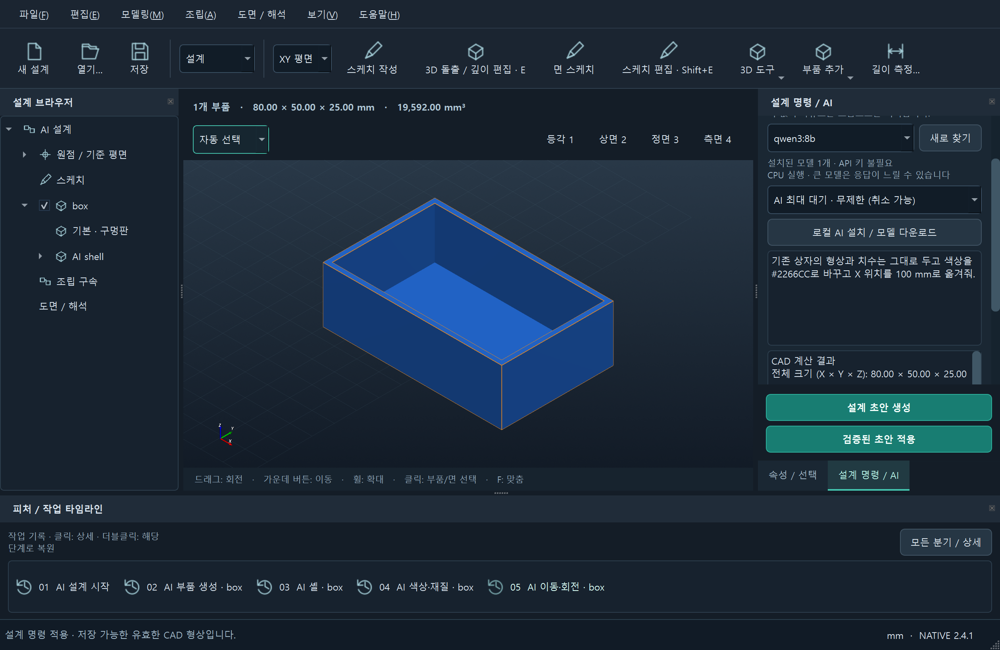
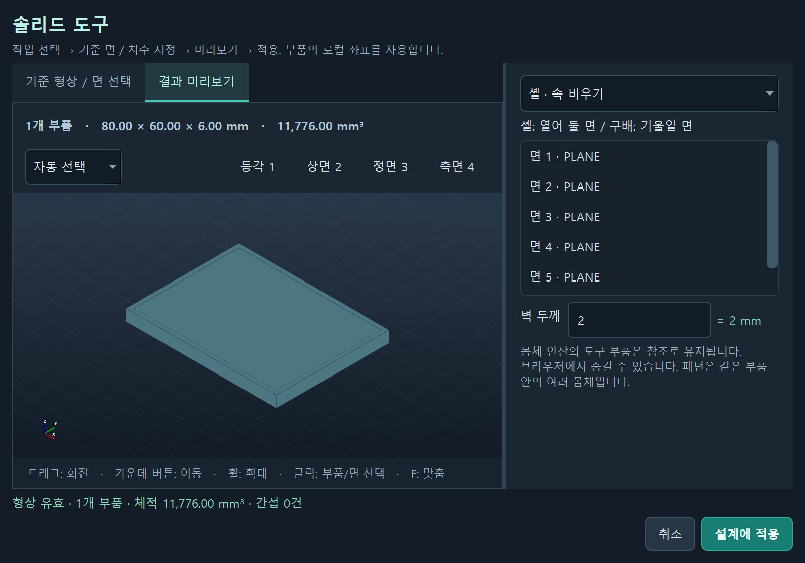
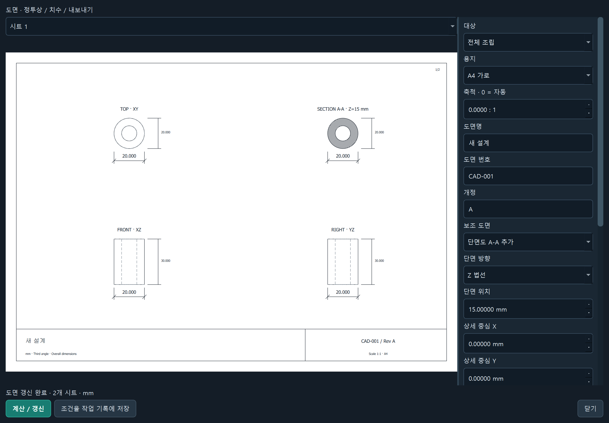
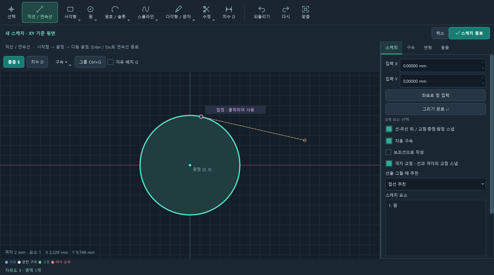
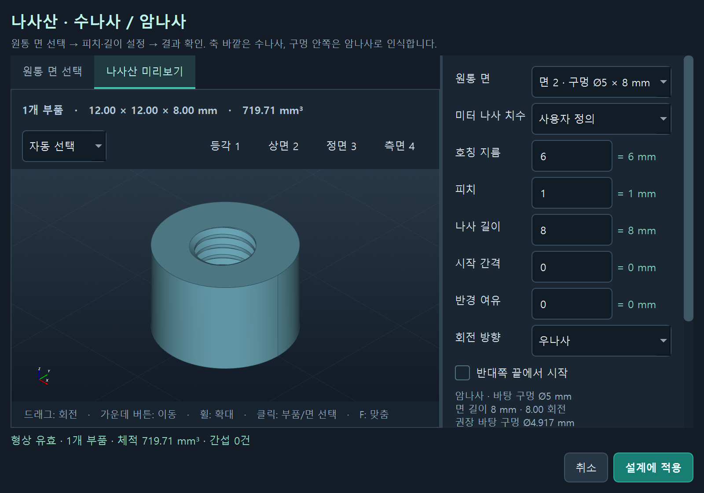

# 2.5.0 selection / assembly visibility validation

Source regression: 388 passed, 102 warnings in 125.47s (0:02:05). Frozen native EXE: 109 checks across kernel/basic/direct/selection flows. All 78 bundled CAD modules and the entry point match the tested source.

Real Qt/VTK checks cover Shift click and Shift drag, box containment/crossing and hidden-part exclusion, tree Shift range, group/ungroup and history, internal assembly copy/cut/undo/redo, text-input shortcut focus, occluded joint picking, compact layout, save/reopen, deleting all parts, and sketch clipboard/group removal. Pure regression also verifies closed loops, motion links, imported assets, shared profile copies, and preserved face-sketch placement when deleting support bodies.

The AI runtime/model was not changed in this version. Earlier measured CPU timings in AI_EXPECTATIONS_KO.md are historical evidence, not a new benchmark or general success rate. Fatigue integration is deferred. Clipboard copies are independent numeric snapshots; Ctrl+D retains same-document variable bindings. Group folders do not impose rigid joints.

[Native evidence](docs/selection250-validation.json) · [Selection checks](docs/selection250-report.json)

# 검증 기록 · 2.4.2 Native

2026-09-24. 전체 소스 검사 **377개 통과**, 경고 101개, 102.29초. 배포 EXE의 cadstudio **72개 모듈**과 진입 스크립트가 최종 소스와 일치합니다. 실제 EXE의 커널 조립 재현·기본 CAD·직접 조작 검사 **74개**를 통과했습니다. [배포 검사 기록](docs/native-release242-report.json).

## 배포 후 실제 EXE AI 검사

게시한 v2.4.2 ZIP의 설치 목록 **1127개 파일**과 해시가 일치하는 EXE를 별도 검사 프로필로 실행했습니다. 실제 Qwen3 8B CPU 모델을 사용한 **추가 28개 검사**가 통과했습니다. 위 74개 배포 검사와 별도의 실행이며 배포한 바이너리는 변경하지 않았습니다.

80×50×25 mm, 벽과 바닥 두께 2 mm인 열린 상자 생성은 **141.344초**, 형상을 보존한 색상 #2266CC·X 위치 100 mm 편집은 **168.828초**였습니다. 실제 체적 19,592 mm³와 바닥·윗면 개방, 색상·위치, 작업 이력 저장/재열기를 확인했습니다. 무제한 대기 중 생성 취소는 **0.36초**, 창 닫기는 **0.125초**였습니다. 모델과 부하에 따라 달라지는 개별 측정 결과입니다. [EXE AI 검사 기록](docs/ollama-cad242-report.json).

## 실제 모델 출력에서 발견한 조립 오류

설치된 Qwen3 8B에 외경 30 mm, 높이 20 mm, 내경 10.2 mm인 부싱과 지름 10 mm, 높이 20 mm인 축을 회전 관절로 조립하도록 요청했습니다. 모델은 필요한 부품과 관절을 만들었지만, 이미 관절로 지정된 축의 Z=0 위치를 다시 지정했습니다. 이전 실행기는 같은 위치여도 거부해 세 번의 계획이 모두 실패했습니다.

수정 후 저장해 둔 **세 계획을 그대로 재실행**해 두 부품의 정확한 체적, 간섭 없음, 회전 자유도 1개, 관절 보존과 5개 이력 항목을 확인했습니다. 같은 위치임이 검증된 명령만 받아들이며, 다른 위치로 이동하거나 잘못된 값을 넣으면 현재 문서를 변경하지 않습니다. [원래 모델 출력과 재현 결과](docs/ollama-assembly242-replay.json).

조립 출력 형식도 실제 지원하는 원점 기준과 축별 최소·최대 범위로 제한했습니다. 모델이 만들었던 임의의 기준점 문자열과 `min`/`max` 최상위 키는 출력 규칙에서 제외됩니다. 경계·제약의 최종 검증은 계속 CAD 실행기가 담당합니다.

실제 재생성에서 형상은 맞아도 회전 관절을 고정 관절로 바꾸고 기준 부품과 움직이는 부품을 뒤집는 오류도 발견했습니다(192.734초, 검증 실패). 이에 도구 선택 단계에서 요청의 관절 종류와 부모·자식 부품 ID를 먼저 추출하고, 생성 형식과 실제 CAD 결과에 같은 조건을 적용합니다. 불일치는 성공으로 표시하지 않고 기존 수정 절차로 돌립니다. 특정 물건 이름에 따른 처리는 없습니다. 조건 추출 자체도 모델이 수행하므로 원문 이해가 항상 정확하다는 보장은 아닙니다.

그 다음 재시험은 같은 부품의 ID를 서로 다르게 부르는 오류로 세 번 모두 실패했습니다(567.7초). 최종 수정은 새 부품 ID 목록을 먼저 정해 생성·피처·조립에서 재사용하도록 제한하고, 빠진 부품도 검사합니다. 이미 있는 구멍을 다시 뚫는 오류 안내가 불필요한 패턴을 유도하지 않도록, 기존 보어부터 확인해 중복 작업을 삭제하도록 수정했습니다. 수정 이후 새 시험의 통과 결과는 별도로 명시합니다.

이 세 계획의 검사는 새 모델 호출의 성공률 측정이 아닙니다. 별도 재생성 검사는 다른 작업과 겹쳐 남은 RAM이 약 1.2 GiB가 된 상태에서 중단했습니다. 해당 검사 프로세스와 모델 캐시만 정리했으며 사용자 CAD 창이나 다른 계산 작업은 종료하지 않았습니다. 새 모델의 모든 조립 요청 성공이나 일정한 응답 속도를 보장하지 않습니다.

메모리 여유가 회복된 뒤 최종 소스로 실제 Ollama 요청을 새로 실행해 **조립 생성과 기존 축 높이 편집 두 건을 통과**했습니다(bushing-shaft-assembly: 222.547초 / edit-assembled-shaft: 164.266초). 두 부품의 정확한 체적·치수, 간섭 없음, 회전 자유도 1개와 45° 자세를 확인했습니다. 축 높이를 20→30 mm로 바꾼 뒤 부싱·부품 ID·색상·위치·관절 보존도 확인했습니다. 이 두 건은 소스의 실제 모델 호출이며 위 EXE 검사와는 별도입니다. 일반적인 성공률 측정은 아닙니다. [새 실제 요청 결과](docs/ollama-assembly242-live.json).

아래 2.4.1에는 실제 Ollama 생성·편집·취소와 여러 단품 요청의 별도 측정이 있습니다. 이번 패치는 관절 입력과 이미 만족된 배치의 처리에 집중했습니다. Autodesk가 설치되지 않아 F3D/IPT의 실제 변환은 여전히 미검증이며 STEP/STL은 기본 지원합니다.

아래는 이전 버전의 검증 기록입니다.

---

# 검증 기록 · 2.4.1 Native

2026-09-24. 소스 전체 검사 **366개 통과**, 경고 100개, 151.36초. 사용자 자동저장과 분리된 검사 폴더를 사용했습니다.

## 범용 CAD 작업 계획

로컬 모델이 사용할 도구·형상을 먼저 선택하고, 그 범위에서 작업 계획을 만듭니다. 물건 이름별 전용 생성 경로는 없습니다. 최대 32개 선언형 작업을 실제 CAD 커널로 실행하며, 실패한 단계와 필드를 전달해 최대 두 번 수정합니다. 실패·취소된 초안은 문서에 적용하지 않습니다. 각 작업은 별도 이력으로 저장됩니다. 이 검증은 형상의 유효성을 확인하며 모든 요청 의도나 제조 적합성을 보장하지 않습니다.

자동 검사는 단면 돌출, 단계별 회전 형상, 원형 단면 로프트, 패턴 구멍, 셸, 나사·조립 도구와 기존 부품 보존을 확인합니다. 선택·생성 두 네트워크 단계에서 첫 응답 전/스트림 중 취소, 하나의 전체 제한 시간, 무제한 읽기, 잘못된 도구 선택, 정확한 실패 피드백을 검사합니다. 빈 시작 화면, 명시적 자동저장 복구와 기존 복구 파일 보존도 확인합니다. 실제 렌더링의 픽셀 검사로 빈 상자의 내벽과 바닥이 구분되는지 확인하며, 모델의 잘못된 치수·색상 설명보다 실제 CAD 계산값이 먼저 표시되는지 검사합니다. 1024×640 및 820×560 창에서 스크롤 위치와 무관하게 생성·취소·적용 버튼이 보이는지도 확인합니다.

실제 설치된 Qwen3 8B 모델을 이 PC의 기본 Ollama 서버에서 CPU로 실행해 아래 다섯 요청을 확인했습니다. 각각 하나의 연결된 솔리드, 계산한 체적과 요청한 전체 치수를 확인했습니다. 이 표는 지정된 요청의 개별 결과이며 임의 요청에 대한 성공률을 뜻하지 않습니다. [요청·작업·측정 기록](docs/ollama-cad241-cases.json).

| 요청 | 전체 소요 시간 | 계획 시도 | 체적 mm³ |
|---|---:|---:|---:|
| 열린 상자 | 189.53초 | 1회 | 19,592.00000 |
| 구멍 패턴 고정판 | 298.66초 | 2회 | 23,607.30092 |
| 계단축 | 188.77초 | 1회 | 11,686.72467 |
| 임의 L자 단면 | 186.53초 | 1회 | 4,650.00000 |
| 원형 단면 로프트 | 482.02초 | 2회 | 36,651.91429 |

## 실제 Windows EXE

배포 EXE의 cadstudio **72개 모듈**과 진입 스크립트가 최종 소스와 일치합니다. 실제 EXE의 기본 CAD·직접 모델링·로컬 AI 흐름 **94개 검사**가 통과했습니다. [검사 결과](docs/native-release241-report.json).

실제 설치된 **qwen3:8b**로 80×50×25 mm, 벽·바닥 두께 2 mm인 열린 상자를 생성하고 정확한 체적 19,592 mm³를 확인했습니다. **210.437초**가 걸렸습니다. 형상을 유지한 색상·위치 수정은 **230.343초**, 생성 취소 **0.063초**, 생성 중 창 닫기 **0.141초**였습니다. 이 PC에서 두 요청을 실행한 결과이며 일반적인 성공률이나 속도를 뜻하지 않습니다. [실제 Ollama 측정](docs/ollama-cad241-report.json).

AI 네트워크 취소와 별개로 실행 중인 CAD 커널 연산 자체의 강제 중단은 지원하지 않습니다. 무제한 대기도 출력 길이·치수·형상 검증을 해제하지 않습니다. 유료 클라우드 요청은 실행하지 않았습니다. Autodesk가 설치되지 않아 F3D/IPT 브리지의 실제 변환은 검증하지 못했습니다.

아래는 이전 버전의 검증 기록입니다.

---

# 검증 기록 · 2.4.0 Native

2026-09-24. 전체 Python 회귀 검사 **316개 통과**, 실패 0개(119.96초). 치수식 재편집을 보강한 뒤 관련 검사 **43개**, 마지막 면 재선택 수정 뒤 네이티브 관련 **9개**도 통과했습니다. 전체 검사에는 기존 VTK/Starlette 폐기 예정 API와 Pydantic 직렬화 경고 96개가 남습니다. 검사용 프로젝트와 자동 저장은 사용자 데이터에서 분리했습니다.

- 공유 스케치 수정의 여러 돌출 반영·저장/재열기, 회전 체적, 대칭·양방향 경계, 테이퍼, 셸·구배, 몸체 연산과 순환 거부, 분할·패턴을 확인했습니다.
- 바뀐 면/모서리의 참조 재탐색, 동적 관통, 구멍 마감, STEP/IGES/STL 가져오기와 원본 삭제 뒤 프로젝트 복원, 가져온 형상의 해시 검증을 확인했습니다.
- 추가 관절의 자세와 자유도, 모션 비율·한계·순환 참조 거부, 폐루프 수동 관절 한계, 재질·질량·단면적·구성표를 확인했습니다.
- 단면/상세/다중 도면, 단일 판금 절곡의 체적·전개 길이·DXF 경계를 확인했습니다.

최종 Windows EXE의 cadstudio 모듈 **67개**와 시작 스크립트를 현재 소스와 비교했습니다. 실제 EXE 검사 **185개**가 통과했습니다: 확장 도구 18개, 기본 CAD 42개, 추가 도구 59개, 직접 조작 28개, 나사산 17개, 스케치 추천 21개. [배포 EXE 전체 결과](docs/native-release240-report.json).

네이티브 창의 셸 미리보기·피처 관리·회전·판금·모션 연결·단면 검사·다중 PDF와 가져온 프로젝트 재열기를 실행했습니다. 아래 이미지는 앱 자신의 Qt/VTK 렌더링 캡처입니다.

설치된 Ollama 0.34.3 / Qwen3 8B로 **Ø12×8 mm 원통** 생성과 형상 검증을 통과했습니다. **71.64초, 1회 시도**, Windows 빌드와 동시에 CPU로 실행한 한 건의 실측입니다. 복잡한 조립의 성공률이나 일정한 속도를 보장하지 않습니다. [Ollama 실측](docs/ollama240-report.json). 유료 클라우드 요청은 실행하지 않았습니다.

지원 경계는 [전체 요청별 구현 상태](docs/DEVELOPMENT_SCOPE.md)와 [사용 설명서](docs/USER_MANUAL_KO.md)에 명시했습니다. 전체 Fusion 기능을 구현한 것은 아닙니다. 이전 스케치 복사본을 자동 연결하지 않으며, 투영의 실시간 연동·완전한 위상 추적·물리 접촉·다중 판금 절곡·CAM·PCB·범용 해석·동시 협업은 남아 있습니다. F3D/IPT는 기존 Autodesk 변환 연결이며 해당 Autodesk 앱의 실제 변환은 이 PC에서 검증하지 못했습니다.

아래는 이전 버전의 검증 기록입니다.

---

# 검증 기록 · 2.3.1 Native

2026-09-23. 전체 Python 검사 **279개 통과**, 실패 0개(143.82초). 기존 VTK/Starlette 폐기 예정 API와 Pydantic 직렬화 경고 68개가 남아 있습니다. 임시 검사 파일과 자동 저장은 사용자 데이터와 분리했습니다.

- 수나사·암나사의 좌/우 방향, 시작 간격, 반대쪽 시작, 임의 축, 반경 여유, 축방향 범위와 실제 나선 절삭량을 확인했습니다. M2/M5/M12/M20/M48 및 32회전 경계 사례를 검사했습니다.
- M6 볼트·암나사의 교차 체적, STEP 재읽기, STL 생성, 변수 식·기록 저장과 피처 재편집을 확인했습니다. 형상이 바뀐 면 참조·얇은 벽·불완전 원통·잘못된 치수는 거부합니다.
- 원·원호·타원·스플라인의 접선/법선 접점 정확도, 원호 중점, 빈 격자점과 곡선 우선순위, 참조 경계 교점/원 중심/떨어진 평행·수직선의 구속 보존을 확인했습니다.
- 선택한 피처의 스케치 편집, 접선의 잘못된 과다 구속 판정 방지, 자유 배치와 빠른 구속 메뉴를 검사했습니다.

최종 Windows EXE에 포함된 cadstudio 모듈 **51개**의 코드가 최신 소스와 일치함을 확인했습니다. 실제 EXE의 새 스케치 흐름 **21개**, 나사산 흐름 **17개**를 통과했습니다. [스케치 EXE 검사](docs/native-sketch-guide-report.json), [나사산 EXE 검사](docs/native-thread-report.json).

기존 기본 CAD **42개**, 추가 도구 **59개**, 직접 조작 **28개**도 최종 EXE에서 통과했습니다. 새 검사와 합계 **167개**입니다. [2.3.1 배포 검사 요약](docs/native-release231-report.json).

나사는 단일 시작·평면 절단 60° 프로파일·피처당 1~32회전입니다. ISO 공차 등급 인증·관용 테이퍼·둥근 뿌리 프로파일은 포함하지 않습니다. 면 경계 참조는 투영 당시의 복사이며 임의의 3D 곡면 교선을 새로 계산하지 않습니다. 별도로 보존한 원본 스케치는 재사용용 복사본이고, 기존 솔리드는 해당 부품 기본/피처 스케치에서 편집합니다.

아래는 이전 버전의 검증 기록입니다.

---

# 검증 기록 · 2.3.0 Native

2026-09-23. 전체 Python 검사 **233개 통과**, 실패 0개(28.53초). VTK/Starlette 폐기 예정 API와 기존 Pydantic 직렬화 경고 60개가 남아 있습니다.

- 변수 식의 안전한 파싱, 단위 환산, 순환 참조/0 나눗셈/임의 코드 차단, 원통 체적과 스케치 치수 재계산, 변경 전후 기록 저장/재열기.
- 자유 위치의 점·선·사각형, 나중에 원점 고정, 중복 구속과 충돌 구속 구분.
- 3D 프로파일 선택, 드래그 깊이 변경, 반대 방향 돌출의 정확한 경계, 면 구멍 절삭과 기존 피처 깊이 변경.
- 정확한 CAD 꼭짓점/모서리 필터, 입력 중 단축키 억제, 기본 Ollama 패널, F1 매뉴얼.
- AI 요청의 표시 캐시 생략/복원과 사용자가 선택한 read timeout 반영, 기존 취소/종료 회귀 검사.

이 PC의 Ollama 로그에서 10,418토큰 입력을 CPU가 읽던 중 120초 read timeout으로 중단된 사례를 확인했습니다. 표시 캐시를 뺀 같은 현재 설계의 직렬화 크기는 16,201자에서 6,553자로 감소했습니다(이전 기본 JSON 공백과 새 압축 JSON 공백 차이 포함). 이는 응답 성공률이나 일정한 생성 시간을 보장하지 않습니다. 전체 네트워크 최대 대기 기본값은 600초입니다.

배포 EXE의 기본 CAD 흐름 **42개**, 추가 도구 **59개**, 직접 조작 **28개** 검사를 통과했습니다. 3D 손잡이를 실제 화면 좌표에서 잡아 깊이를 바꾸고, 꼭짓점 선택·변수 변경·기록 재열기·과다 구속 경고·F1 매뉴얼을 확인했습니다. [직접 조작 검사](docs/native-direct-modeling-report.json), [3D 돌출 화면](docs/native-direct-extrude.png).

실제 배포 EXE의 Ollama/그룹 검사 **28개**도 통과했습니다. 설치된 Qwen3 8B(CPU)에서 Ø20×10 mm 원통 초안 생성 **55.92초**, 높이만 25 mm로 수정 **25.73초**, 취소 **0.031초**, 생성 중 창 닫기 **0.047초**였습니다. 작은 요청 두 건의 실측이며 복잡한 설계의 성공률·속도를 보장하지 않습니다. [v2.3.0 EXE 실측](docs/native-reliability230-report.json).

아래 2.2.1 이하 기록은 이전 버전의 실측입니다.

---

# 검증 기록 · 2.2.1 Native

2026-09-23. 전체 Python 검사 **217개 통과**, 실패 0개. 기존 VTK/Starlette/Pydantic 경고 20개.

추가 회귀 검사는 NDJSON 분할 수신과 UTF-8, 첫 응답 전 취소, 서버 정지 시간 제한, 오류/불완전/출력 한도, CAD 편집 중 초안 생성, 늦은 결과 폐기, 생성 중 앱 종료를 확인합니다. 스케치 그룹의 중첩 윤곽과 여러 영역, 이름과 멤버 저장, 작업 기록 재열기, 커서 영역 추천, Ctrl 다중 영역 선택, 그룹 돌출/절삭의 정확한 체적과 원본 보존도 검사합니다.

소스 GUI에서 설치된 Qwen3 8B 모델로 Ø20×10 mm 원통의 생성·형상 검증·적용을 통과했습니다. 약 59.95초, 취소 0.047초. 이는 작은 요청 한 건이며 복잡한 프롬프트의 성공률을 보장하지 않습니다. 배포 EXE 검증 결과는 `docs/native-reliability-report.json`에 기록합니다.

AI 네트워크 작업을 Qt 전역 작업 풀과 분리했습니다. 취소가 비동기 네트워크 읽기를 중단하고, 종료 시 해당 작업이 프로세스를 붙잡지 않습니다. 진행 상태를 주 스레드에 명시적으로 전달하며 5분의 전체 네트워크 제한을 둡니다. 생성 도중 문서가 바뀌면 오래된 초안을 적용하지 않습니다. CAD 커널 계산 자체에 대한 강제 중단 기능은 아닙니다.

Ollama 프로토콜 참고: [스트리밍 Chat API](https://docs.ollama.com/api/chat), [구조화 출력](https://docs.ollama.com/capabilities/structured-outputs).

## 실제 배포 EXE 확인 · 2.2.1

실제 Windows EXE에서 기본 흐름 40개, 추가 도구 59개, AI/그룹 흐름 28개 검사를 통과했습니다. 설치된 Qwen3 8B로 원통 초안 생성 **53.42초**, 지름을 보존한 높이 수정 **24.58초**, 취소 **0.110초**, AI 실행 중 창 닫기 **0.047초**. 작업 중 주 이벤트 루프를 853회 처리했습니다. [배포 EXE 실측](docs/native-reliability-report.json).

---

# 검증 기록 · 2.2.0 Native

2026-09-23 · Windows 64비트 · Python 3.12.14 · Qt 6.10.2 · VTK 9.6.2 · CadQuery 2.8.0 / OCCT 7.9.3.

## 자동 검사

전체 Python 검사 **205개 통과**, 실패 0개. VTK/Starlette 폐기 예정 API 등 17개 경고가 있습니다. 검사 임시 파일과 자동 저장 데이터는 사용자 프로젝트와 분리했습니다.

- 기본 솔리드와 정확한 체적, 스케치 클릭·스냅·구속, 면 피처·조인트·기록 저장/재열기.
- 요소별 자유도 색상, 선 선택→영역 돌출, 격자점/곡선 교점, 길이 측정, 구멍 절삭량.
- 실제 OCCT 스윕/로프트/쉘/모서리 피처와 잘못된 참조 거부.
- 4절 링크 닫힘 및 불가능한 위치 거부. 2R 질량행렬·중력 평형·에너지·IK·부착 부품 질량.
- 인장 TET4의 균일 봉 F/A·FL/EA, 반력 평형, 원통/평판 시편 메시 검사.
- 정투상/숨은선/치수 갱신, SVG와 DXF 재읽기. 공차의 형상 연결·한계값·기록·도면 반영.
- 설치된 Ollama 모델 재사용·중단·목록 자동 검색·기존 서버 시작. 공급자 구조화 응답과 오류·재검증.
- 업데이트 해시·경로 검증, 사용자 파일 보존, 부분 교체 실패 롤백과 중단 복구.
- F3D/IPT 준비 작업의 실제 STEP 재불러오기, 스크립트 구성, 기존 출력 파일 보존. PowerShell 변환 스크립트 구문 검사.

## 실제 배포 EXE

최종 PyInstaller EXE에서 기본 워크플로 **40개 항목**, 추가 워크플로 **59개 항목**이 통과했습니다. Qt 창 노출, 뷰포트 가시성과 크기, VTK의 실제 프레임버퍼를 검사합니다.

기본 흐름: 클릭 스케치 → 종료 → 돌출 → 면 선택 → 면 스케치 → 포켓 → 프로젝트 저장/재열기 → STEP → 작업 기록 복원 → 로봇/시편/면 조인트.

추가 흐름: 스윕/로프트 STEP, 모서리 선택과 필렛 결과, 관통 구멍 체적 감소, 꼭짓점 길이 측정, 폐루프, 동역학 시간 슬라이더, 시편 응력 화면, 도면 SVG/PDF/DXF, 해석 설정 기록 재열기, 연결 공차/도면 표, 교차 체적 강조, F3D/IPT 변환 준비, 로컬 AI 설치 창.

측정·간섭 창이 주 창의 자식으로 생성될 때 작아지던 레이아웃 문제를 수정하고, 실제 렌더링 영역의 최소 크기 검사를 추가했습니다. 로봇 설정은 세로 스크롤 안에서 줄바꿈되며, 도면은 종횡비를 유지합니다.

보고서: [기본 CAD](docs/native-smoke-report.json) · [추가 도구](docs/native-advanced-report.json). 이미지는 앱 자신의 Qt 캡처와 해당 VTK 프레임버퍼이며 외부 데스크톱 앱의 화면을 수집하지 않습니다.

## 실제 로컬 AI

Ollama 0.34.3과 Qwen3 8B Q4_K_M을 설치하고 이 PC의 localhost로 실행했습니다. 32GB RAM / CPU 추론에서 원통 Ø20×10 mm 생성과 CAD 검증 **52.797초**, 높이만 25 mm로 변경 **36.968초**. 두 요청 모두 1회에 유효한 CAD를 반환했습니다. 실행 중 API가 보고한 모델 메모리는 약 7.9GB, VRAM 0이었습니다.

이는 작은 요청 두 건의 실측값이며 복잡한 조립의 성공률이나 속도를 대표하지 않습니다. [실측 기록](docs/ollama-validation.json). OpenAI 유료 요청은 실행하지 않았습니다.

## 범위와 별도 환경이 필요한 검증

[설계·해석 안내](docs/ENGINEERING.md)에 지원 가정과 수치 한계를 기록했습니다. 일반 접촉/폐루프 동역학, 소성·파단·피로, GD&T와 시험 규격 인증을 제공하지 않습니다. 공차는 입력한 편차의 최악 조건 계산이며 ISO 등급표 자동 인증이 아닙니다.

STEP/STL은 앱에서 직접 생성합니다. F3D는 공식 Fusion API 스크립트, IPT는 설치된 Inventor COM API로 변환하는 메뉴를 제공합니다. 이 PC에서는 Inventor가 감지되지 않았으며 **Autodesk 앱에서 실제 F3D/IPT 생성은 아직 시험하지 못했습니다.** 생성 전 상태를 변환 완료로 표시하지 않습니다. Autodesk 타임라인의 재구성도 지원하지 않습니다.

2.1.2에서 검증한 Tcl/Tk 포함 업데이터를 그대로 사용합니다. [업데이터 수정 검증](docs/validation-2.1.2.md) · [2.0 기록](docs/validation-2.0.md).
